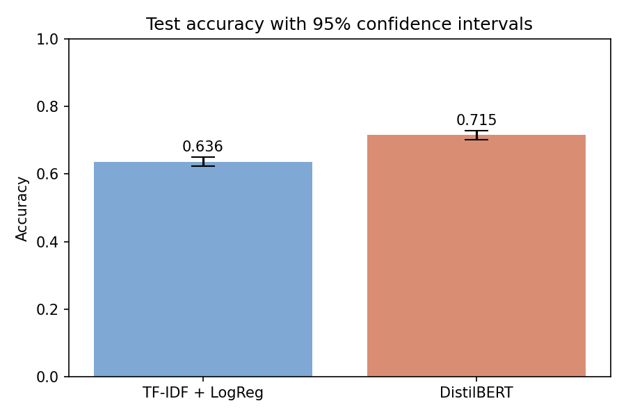
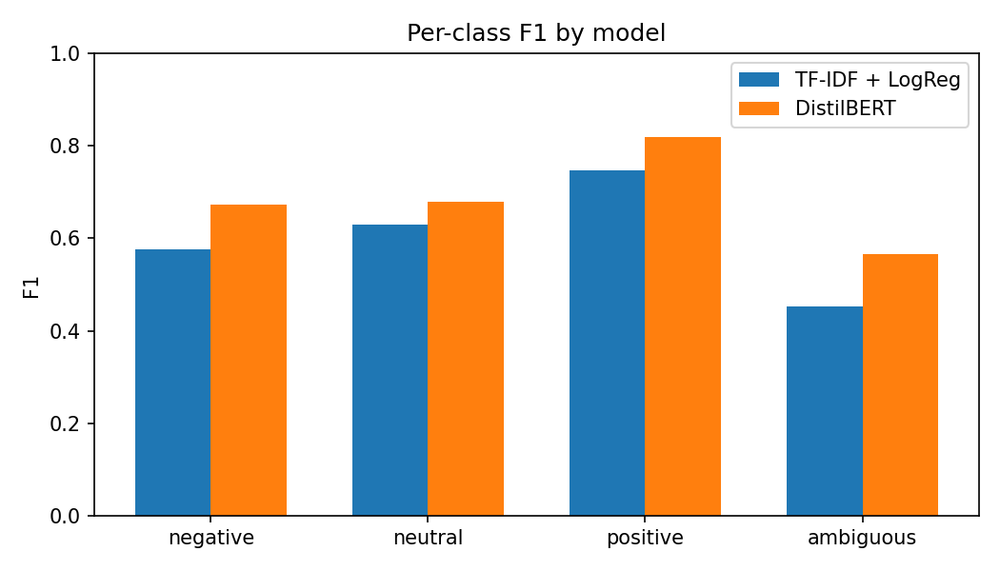
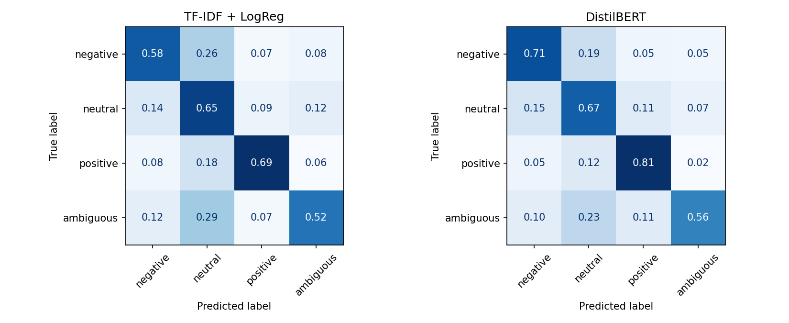

---
format:
  pdf:
    pdf-engine: pdflatex
    documentclass: IEEEtran
    classoption: [conference, letterpaper]
    keep-tex: true
  docx:
    reference-doc: conference-template-letter.docx
editor: visual
include-in-header:
  text: |
    \usepackage{tikz}
    \usetikzlibrary{arrows.meta,positioning,shapes.geometric}
header-includes:
  - \usepackage{amsmath, amssymb, amsthm}
  - \usepackage{booktabs}
  - \usepackage{graphicx}
  - \usepackage{float}
  - \usepackage{multirow}
  - \usepackage{algorithm}
  - \usepackage{algorithmic}
  - \usepackage{setspace}
  - \usepackage{caption}
  - \usepackage{hyperref}
---

::: {.content-visible when-format="pdf"}
```{=latex}
\title{Sentiment Classification on GoEmotions: A Comparative Study of Text Classification Methods}
\author{
  \IEEEauthorblockN{Anuruddha Ekanayake}
  \IEEEauthorblockA{\textit{School of Computing} \\
    \textit{University of Nebraska-Lincoln}\\
    Lincoln, USA \\
    aekanayake2@nebraska.edu}
  \and
  \IEEEauthorblockN{Arian Alai}
  \IEEEauthorblockA{\textit{Institute of Agriculture and Natural Resources} \\
    \textit{University of Nebraska-Lincoln}\\
    Lincoln, USA \\
    aalai4@nebraska.edu}
  \and
  \IEEEauthorblockN{Daniel Crow}
  \IEEEauthorblockA{\textit{School of Computing} \\
    \textit{University of Nebraska-Lincoln}\\
    Lincoln, USA \\
    dcrow2@nebraska.edu}
}
\maketitle

\begin{abstract}
In progress...
\end{abstract}
```
:::

::: {.content-visible when-format="docx"}
# Sentiment Classification on GoEmotions: A Comparative Study of Text Classification Methods {.unnumbered .center}

| Anuruddha Ekanayake | Arian Alai | Daniel Crow |
| :---: | :---: | :---: |
| School of Computing | School of Computing | School of Computing |
| University of Nebraska-Lincoln | University of Nebraska-Lincoln | University of Nebraska-Lincoln |
| Lincoln, USA | Lincoln, USA | Lincoln, USA |
| aekanayake2@huskers.unl.edu | aalai2@huskers.unl.edu | dcrow2@huskers.unl.edu |

**_Abstract_—In progress...**
:::

# Introduction

Emotion and sentiment analysis are fundamental tasks in Natural Language Processing (NLP). These tasks allow for the conversion of raw, human language into structured data denoting emotional intent, making them useful tools for a wide range of applications, including customer service, social media analysis, and public opinion monitoring. The widespread adoption of social media has especially led to a massive influx of informal text, which is often characterized by noisy writing, slang, and complex emotional expressions. Standard sentiment analysis (classifying text into positive, negative, or neutral) is often insufficient for capturing the nuances of these diverse expressions. 

The GoEmotions dataset [@demszky-etal-2020-goemotions] is a large, human-annotated corpus of 58k Reddit comments labeled with 28 fine-grained emotion categories. In this project, we address a simplified variant of the task: 4-way single-label sentiment classification. We filter the comments to keep only those with exactly one emotion label, and map that label to one of four sentiment classes: *positive*, *negative*, *neutral*, or *ambiguous*.

To address this task, we compare two modeling approaches. The first is a baseline model that combines TF-IDF features derived from word- and character-level n-grams with a Logistic Regression classifier. The second is a transformer-based approach that fine-tunes a pre-trained DistilBERT model on the training data.

We evaluate both models on the test split, report their classification accuracy and macro-F1 scores along with 95% bootstrap confidence intervals. We also analyze their per-class performance to determine the best-performing model for the task.

# Problem Description

The sentiment classification task is framed as a supervised single-label classification problem. Given an input text string $x \in \mathcal{X}$ representing a single Reddit comment, the objective is to predict a label $y \in \mathcal{Y}$. Prior to feature extraction, the text is preprocessed by collapsing consecutive whitespace, removing newline characters, and stripping leading and trailing whitespace. The label space is defined as

$$\mathcal{Y} = \{\text{negative}, \text{neutral}, \text{positive}, \text{ambiguous}\}$$

### Sentiment Mapping

We map the original 28 GoEmotions categories to our target categories as follows:

* **Positive:** admiration, amusement, approval, caring, desire, excitement, gratitude, joy, love, optimism, pride, relief.
* **Negative:** anger, annoyance, disappointment, disapproval, disgust, embarrassment, fear, grief, nervousness, remorse, sadness.
* **Ambiguous:** confusion, curiosity, realization, surprise.
* **Neutral:** neutral.

To handle multi-label comments, we restrict the dataset to comments that have exactly one active emotion label. The preprocessed splits contain the following class counts:
* **Train Set:** 36,308 samples (12,920 positive, 12,823 neutral, 7,012 negative, 3,553 ambiguous).
* **Validation Set:** 4,548 samples.
* **Test Set:** 4,590 samples (1,606 neutral, 1,603 positive, 932 negative, 449 ambiguous).

# Models Used

We utilize two models representing different levels of model complexity and linguistic representations.

### Model 1: TF-IDF + Logistic Regression (Baseline)

Our baseline model utilizes a standard bag-of-words approach:
1. **Feature Extraction:** A `TfidfVectorizer` computes tf-idf features using word and character n-grams in the range $(1, 2)$. We restrict the vocabulary to the top 50,000 features, apply sublinear term-frequency scaling ($\text{tf} \leftarrow 1 + \log(\text{tf})$), and filter out features appearing in only one document.
2. **Classification:** A `LogisticRegression` classifier is trained on the TF-IDF representations. To handle class imbalance, we use balanced class weights, which scales the loss inversely proportional to class frequencies. The inverse regularization parameter is set to $C = 1.0$, and the model is trained using the L-BFGS solver.

### Model 2: Fine-Tuned DistilBERT (Transformer)

DistilBERT [@sanh2019distilbert] is a distilled, light version of the Bidirectional Encoder Representations from Transformers (BERT) model. It uses 40% fewer parameters (66 million compared to BERT's 110 million) and is 60% faster, while retaining 97% of BERT’s language understanding capabilities.
1. **Tokenization:** Text is tokenized using the WordPiece tokenizer with a maximum sequence length of 64 tokens.
2. **Architecture:** A classification head (a linear layer mapping the 768-dimensional CLS token representation to the 4 classes) is added on top of the pre-trained DistilBERT layers.
3. **Fine-Tuning:** We fine-tune the model for 2 epochs using the AdamW optimizer with a learning rate of $2 \times 10^{-5}$ and batch size of 16 on the full training dataset of 36,308 examples.

# Performance Comparison

We evaluate both models on the test set of 4,590 samples. To measure statistical significance, we estimate the 95% confidence intervals (CI) for both accuracy and macro-F1 using bootstrapping with $N = 1,000$ resamples.

### Overall Performance

Table 1 summarizes the overall performance of the two models on the test set.

::: {.content-visible when-format="pdf"}
```{=latex}
\begin{table}[h]
\centering
\caption{Overall test performance of the classification models.}
\begin{tabular}{l p{3.5cm} p{3.5cm}}
\toprule
Model & Accuracy (95\% CI) & Macro-F1 (95\% CI) \\
\midrule
\textbf{TF-IDF + Logistic Regression} & 0.636 [0.622, 0.650] & 0.601 [0.585, 0.616] \\
\textbf{Fine-Tuned DistilBERT} & \textbf{0.715} [0.703, 0.728] & \textbf{0.684} [0.669, 0.699] \\
\bottomrule
\end{tabular}
\end{table}
```
:::

::: {.content-visible when-format="docx"}
| Model | Accuracy (95% CI) | Macro-F1 (95% CI) |
|---|---|---|
| **TF-IDF + Logistic Regression** | 0.636 [0.622, 0.650] | 0.601 [0.585, 0.616] |
| **Fine-Tuned DistilBERT** | **0.715** [0.703, 0.728] | **0.684** [0.669, 0.699] |

: Overall test performance of the classification models.
:::

### Per-Class F1 Analysis

Table 2 breaks down the performance by sentiment class using the F1-score indicator.

::: {.content-visible when-format="pdf"}
```{=latex}
\begin{table}[h]
\centering
\caption{Per-class F1-scores on the test set.}
\begin{tabular}{lccc}
\toprule
Class & TF-IDF + LogReg & Fine-Tuned DistilBERT & Improvement \\
\midrule
\textbf{negative} & 0.576 & \textbf{0.674} & +0.098 \\
\textbf{neutral} & 0.629 & \textbf{0.679} & +0.050 \\
\textbf{positive} & 0.747 & \textbf{0.818} & +0.071 \\
\textbf{ambiguous} & 0.452 & \textbf{0.566} & +0.114 \\
\bottomrule
\end{tabular}
\end{table}
```
:::

::: {.content-visible when-format="docx"}
| Class | TF-IDF + Logistic Regression | Fine-Tuned DistilBERT | Improvement |
|---|---|---|---|
| **negative** | 0.576 | **0.674** | +0.098 |
| **neutral** | 0.629 | **0.679** | +0.050 |
| **positive** | 0.747 | **0.818** | +0.071 |
| **ambiguous** | 0.452 | **0.566** | +0.114 |

: Per-class F1-scores on the test set.
:::

### Visualizations

The performance comparisons are illustrated in the figures below. @fig-accuracy shows the test accuracy along with the 95% confidence intervals. @fig-f1-plot shows the per-class F1-scores, illustrating that DistilBERT consistently outperforms the baseline across all classes.

::: {#fig-results layout-ncol=2 fig-env="figure*"}
{#fig-accuracy}

{#fig-f1-plot}

{#fig-confusion-matrices width=100%}

Overall evaluation results, including metrics confidence bounds and error distributions.
:::

### Justification of the Best Model

Based on the empirical results, the **Fine-Tuned DistilBERT** model is the superior model:
1. **Statistical Significance:** The 95% confidence interval for DistilBERT's accuracy ($[0.703, 0.728]$) does not overlap with the baseline's accuracy confidence interval ($[0.622, 0.650]$). The lower bound of DistilBERT is strictly greater than the upper bound of the baseline, which proves that the performance improvement is statistically significant.
2. **Consistent Class Improvements:** DistilBERT outperforms the baseline on all classes. The most significant improvement occurs in the minority "ambiguous" class, where the F1-score increases from 0.452 to 0.566 (+0.114 improvement), and the "negative" class, where the F1-score increases from 0.576 to 0.674 (+0.098 improvement), demonstrating that the contextual transformer is better equipped to handle subtle, complex, and negative emotional expressions.

# Pros and Cons of the Approach

### TF-IDF + Logistic Regression
* **Pros:**
  * **Efficiency:** Training takes less than 30 seconds and requires minimal memory and CPU resources.
  * **Interpretability:** The linear model weights are directly inspectable, allowing us to find the most indicative n-grams for each sentiment.
  * **Simplicity:** No hyperparameter tuning or deep learning infrastructure is required.
* **Cons:**
  * **Lack of Context:** By relying on bag-of-words, the model ignores word order, meaning sentences like "not positive" and "positive, not" have identical feature representations.
  * **Out-of-Vocabulary (OOV):** The model cannot handle words unseen during training.

### Fine-Tuned DistilBERT
* **Pros:**
  * **Contextual Representation:** Captures complex syntactic patterns, semantic dependencies, and word order.
  * **Transfer Learning:** Leverages massive pre-training on general English corpora, allowing it to adapt to social media text with very few training epochs (e.g., fine-tuned on the full 36k examples for only 2 epochs).
  * **Robustness:** Handles spelling mistakes, subwords, and abbreviations via WordPiece tokenization.
* **Cons:**
  * **Resource Intensive:** Requires significant compute time (took ~10 minutes on CPU for a single epoch) and memory.
  * **Black Box:** High-dimensional attention maps and weights make model predictions hard to interpret.

# Conclusion

We compared a traditional linear baseline with a transformer model on a 4-way sentiment classification task using the GoEmotions dataset. Our evaluation demonstrates that a fine-tuned DistilBERT transformer significantly outperforms a TF-IDF + Logistic Regression baseline trained on the same data. The accuracy improvement (0.715 vs. 0.636) is statistically significant as verified by non-overlapping bootstrap confidence intervals. The transformer’s ability to represent word order and contextual nuances is especially beneficial for noisy social media comments, justifying the additional computational cost.